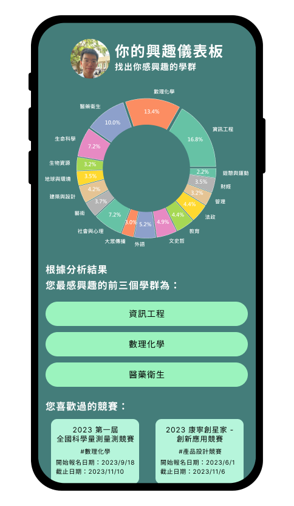
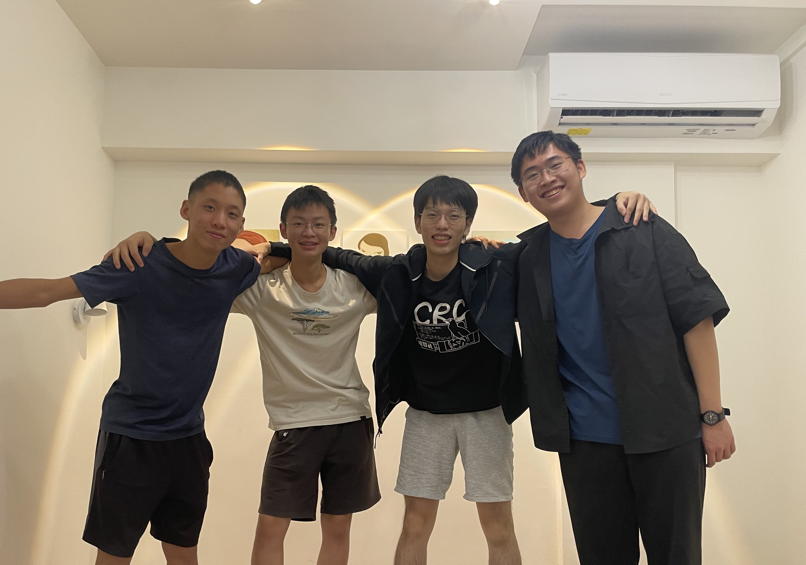

# SightPath


Sightpath是專為高中生設計的活動推薦與生涯探索平台，通過AI模型精確推薦學系探索活動，讓高中生找到最適合自己的科系。


## 核心理念－改變現有的學習情況
在臺灣的教育環境中，學生、導師以及家長通常將「學業表現」視為學習的首要目標，而忽略了對未來志向的探索，與專精於某一領域的學習。此現象導致學生的所學大多集中於基礎學科能力，而課餘活動也以補習為主。
這個現象進一步導致，學生跟家長往往主張「以分數選系」，而忽略了興趣的探索，以及未來生涯的探索。最終導致了部分學生**對自己的生涯方向沒有想法、大學科系的選擇感到迷惘、以及在大學後感到適應困難。**


## 功能
- [ ] 活動推薦演算法
- [ ] 網頁UI優化
- [ ] Line bot活動訊息提醒
- [ ] 用戶生涯儀錶板
- [x] 學習討論論壇
- [x] 競賽查找
- [x] Line login
- [x] 帳號登入系統
- [x] 活動查找

## 網站設計圖



## 開發
python 版本建議為：`3.9`

### 取得專案

```bash
git clone https://github.com/weifish0/SightPath.git
```

### 安裝套件

```bash
pip install -r requirements.txt
```

### 環境變數設定

建立 `.env` 檔案並加入下列變數
```bash
line_token=""
line_secret=""
DEV=""
```

### 運行專案

```bash
# Run DB migration
python3 manage.py makemigrations
python3 manage.py migrate

# Run server
python3 manage.py runserver
```

### 開啟專案

在瀏覽器網址列輸入以下即可看到畫面

```bash
http://localhost:8000/
```

## 資料夾說明

- base - 主要網頁開發
  - api - api相關設定(目前網站暫時不支持RESTFUL)
  - fixtures - 爬蟲資料蒐集
  - migrations - 資料庫更新
  - ml - 推薦演算法
  - template - 覆寫主要模板的前端小組件
  - models.py - 資料庫設定
  - forms.py - 覆寫django預設的表單格式
  - admin.py - 控制後台監測設定
  - urls.py - 決定url與對應的 view function
  - views.py - 網頁核心邏輯實現
- sightpath - 後端設定
- templat - 供base中template覆寫的網頁模板
- static - 靜態資源放置處
...

## 專案技術

- django v4.2.1
- pillow v10.0.0
- line-bot-sdk v3.2.0
- Bootstrap v5.1.3
- python-dotenv v0.21.0
...

## 關於我們


我們是由一群對開源軟體與程式設計懷抱熱忱的大學生和高中生所組成的四人團隊，我們相信只要懷抱熱情，programming可以改變世界。

## sightpath吉祥物


流星所點綴的翅膀將引領學生去追逐宇宙中那看似遙不可及的熠熠繁星，貓頭鷹在西方的愛琴海和基督教文化中是「幸運、智慧」的象徵，願每位學子都能幸運的發現自己志向，向著星辰與深淵勇敢前行。

## 聯絡我們
- Will Cheng: `will060710@gmail.com`
